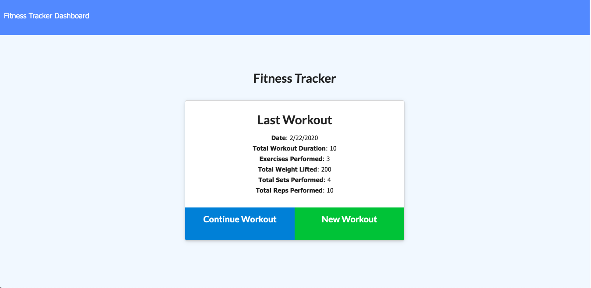
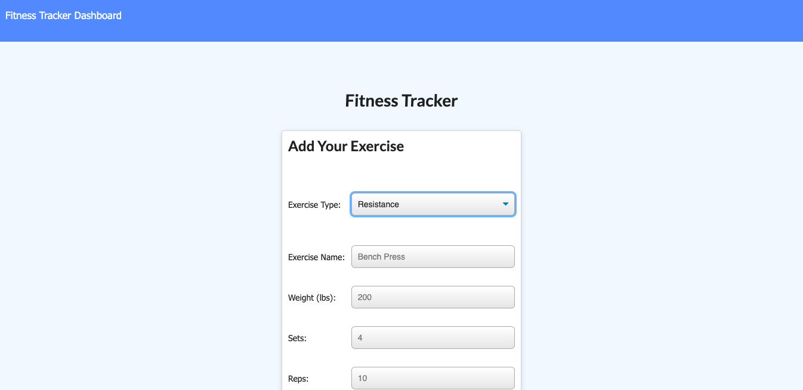
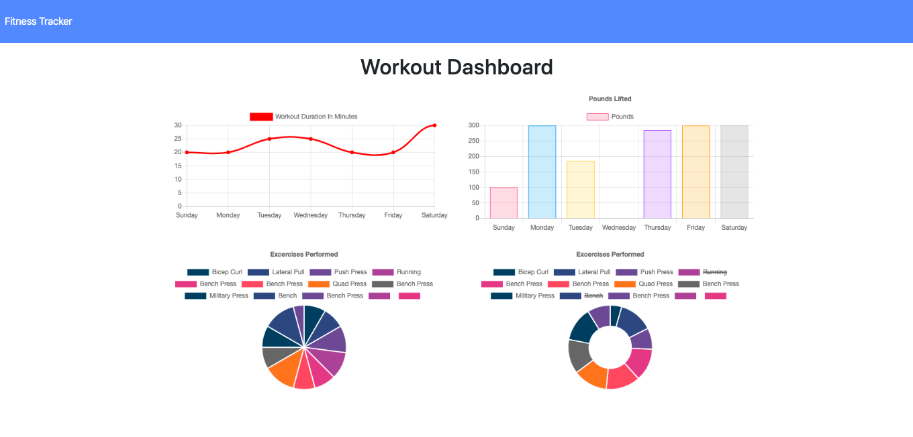

# fitness_tracker

## Installation 
Simply visit [fitness_tracker](https://aqueous-lowlands-63673.herokuapp.com/?id=5e514089c41d790017f05df4) and get started. 

## Purpose
This application helps the user log their workout based on type of workout, Resistance or Cardio. The user can then input the workout details and have them logged into the fitness tracker. The ui then displays the user’s fitness statistic 

## Functionality 
Using MongoDB, and mLab, the user's input is logged and tracked so they can view their workout statistics over time.

## Contributing Resources
* Other Contributors: UNCC Tas and Boot Camp Students

## Links
* Deployed Application:  https://aqueous-lowlands-63673.herokuapp.com/?id=5e514089c41d790017f05df4

* Github Repo:  https://github.com/cmarshman/fitness_tracker

## Images

## License
MIT License

Copyright (c) [2020] [Cory_Marshman]

Permission is hereby granted, free of charge, to any person obtaining a copy of this software and associated documentation files (the "Software"),to deal in the Software without restriction, including without limitation the rights to use, copy, modify, merge, publish, distribute, sublicense, and/or sell copies of the Software, and to permit persons to whom the Software is furnished to do so, subject to the following conditions: The above copyright notice and this permission notice shall be included in all copies or substantial portions of the Software.

THE SOFTWARE IS PROVIDED "AS IS", WITHOUT WARRANTY OF ANY KIND, EXPRESS OR IMPLIED, INCLUDING BUT NOT LIMITED TO THE WARRANTIES OF MERCHANTABILITY, FITNESS FOR A PARTICULAR PURPOSE AND NONINFRINGEMENT. IN NO EVENT SHALL THE AUTHORS OR COPYRIGHT HOLDERS BE LIABLE FOR ANY CLAIM, DAMAGES OR OTHER LIABILITY, WHETHER IN AN ACTION OF CONTRACT, TORT OR OTHERWISE, ARISING FROM, OUT OF OR IN CONNECTION WITH THE SOFTWARE OR THE USE OR OTHER DEALINGS IN THE SOFTWARE.
